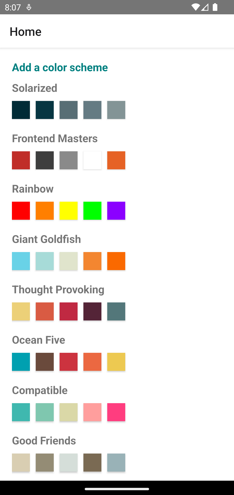
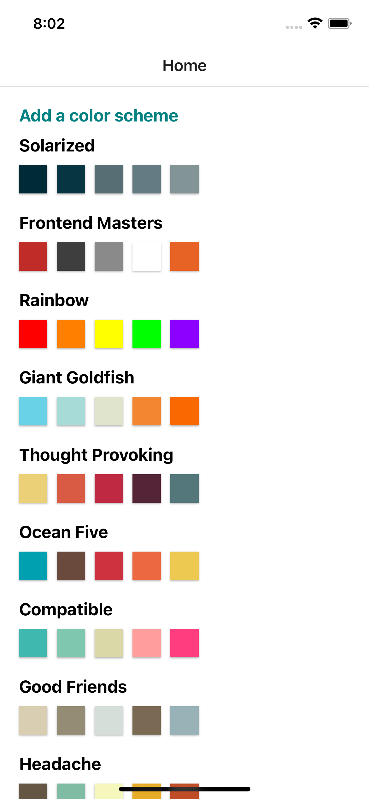
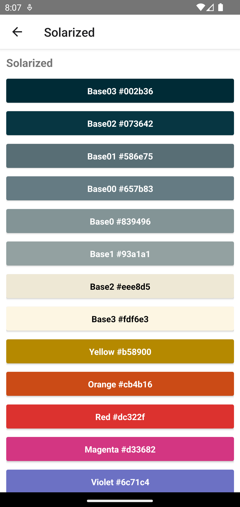
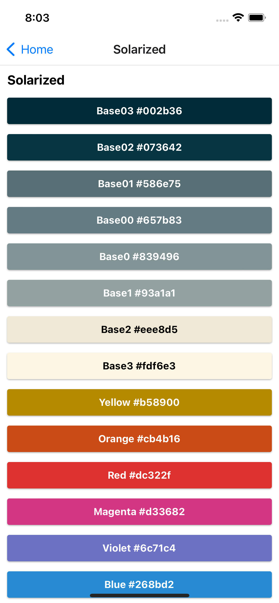
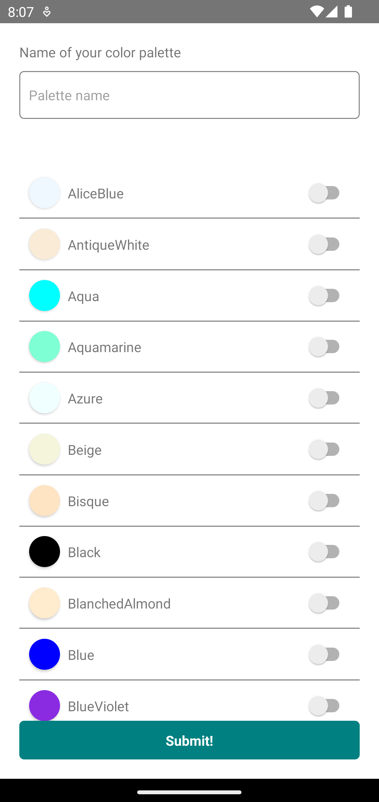
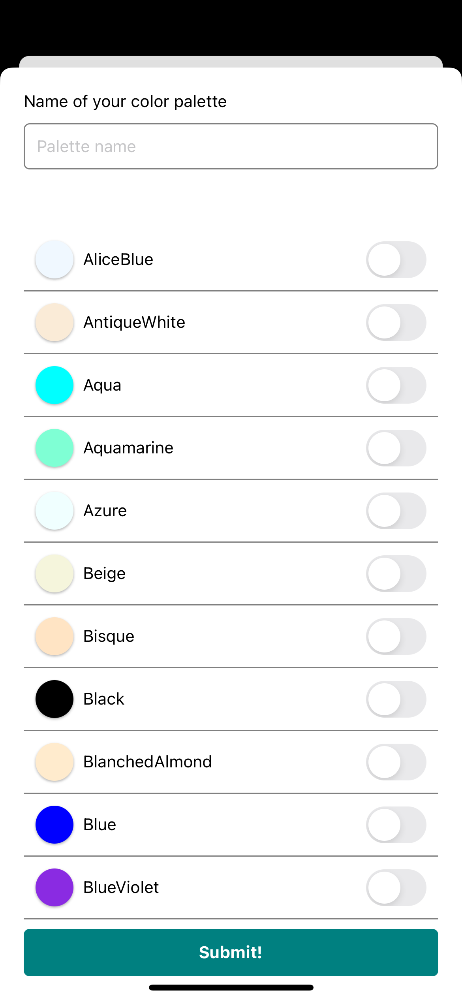

# Color Palette


## About

<p align="center">
React Native project implemented during the Frontend Masters Course using Typescript
</p>

## Table of Contents

=================

- [About](#about)
- [Table of Contents](#table-of-contents)
- [Project Description](#-project-description)
- [Prerequisites](#-prerequisites)
- [Installation](#-installation)
- [Technologies](#-technologies)
- [Author](#-author)

---

## 💻 Project Description

The simple project that was developed for training during the React Native Frontend Masters course. It was developed with [React Native](https://reactnative.dev/). The original course uses Javascript, but I replaced it by [Typescript](https://www.typescriptlang.org/). [React Navigation](https://reactnavigation.org/) was used for routing, using nested and typed routes. The project was configured to follow some standard [eslint](https://eslint.org/) rules and [prettier](https://prettier.io/) helps to keep code standardized.

### Screenshots:

<table>
  <tr>
    <td>Main screen (Android)</td>
    <td>Main screen (iOS)</td>
  </tr>
  <tr>
    <td></td>
    <td></td>
  </tr>
  <tr>
    <td>Color palette screen (Android)</td>
    <td>Color palette screen (iOS)</td>
  </tr>
  <tr>
    <td></td>
    <td></td>
  </tr>
  <tr>
    <td>Add new color palette modal (Android)</td>
    <td>Add new color palette modal (iOS)</td>
  </tr>
  <tr>
    <td></td>
    <td></td>
  </tr>
 </table>

---

<a name="prerequisites"></a>

## ⚙️ Prerequisites

Before starting, you need [Node.js](https://nodejs.org/en/), [Yarn](https://yarnpkg.com/) and [Git](https://git-scm.com/) installed and configured.

```bash
# Clone this repository
$ git clone https://github.com/rafaelfl/ColorPalette

# Enter in the project folder in terminal/cmd
$ cd ColorPalette
```

## 🚀 Installation

After installing the tools and the source code, you can install the dependencies and run the project.

```bash
# Install dependencies
$ yarn install

# Run the project in Android or iOS
$ yarn android
# or
$ yarn ios
```

The application will be shown in the selected emulator. If you have a connected device, the application will run in that device as default.

Some interesting commands:

- `yarn start` - run only the metro bundler, without start any application
- `yarn lint` - run the linter to detect code issues (i.e., not following the configured rules)
- `yarn lint:fix` - run the linter to identify and fix problems in code
- `yarn prettier` - run the prettier formatter

---

## 🛠 Technologies

- [TypeScript](https://www.typescriptlang.org)
- [React Native](https://reactnative.dev/)
- [React Navigation](https://reactnavigation.org/)
- [Yarn](https://yarnpkg.com)
- [eslint](https://eslint.org/)
- [prettier](https://prettier.io/)

---

## 👨‍💻 Author

<a href="https://github.com/rafaelfl/">
 
 <br />
 <sub><b>Rafael Fernandes Lopes</b></sub></a>

Developed with 💜 by Rafael Fernandes Lopes

[](https://www.linkedin.com/in/rafael-fernandes-lopes/)
